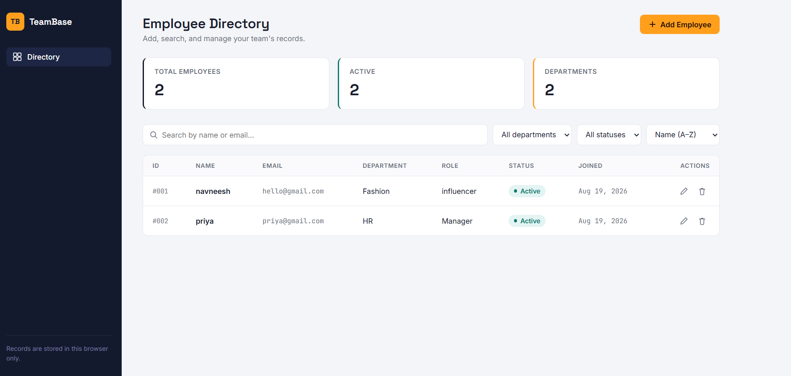
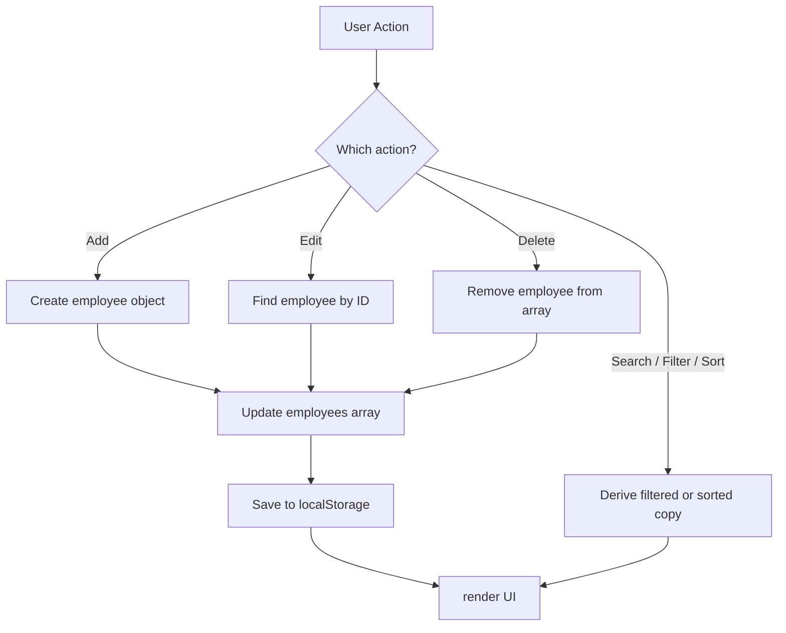

# TeamBase — Employee Directory Dashboard

A responsive employee management dashboard built from scratch using **HTML, CSS, and Vanilla JavaScript**.

TeamBase allows administrators to manage employee records, search and filter employees, sort employee data, and persist changes using the browser's `localStorage` API.

The project was built without frameworks or external libraries to demonstrate core frontend development concepts including DOM manipulation, event handling, form validation, CRUD operations, array methods, browser storage, and responsive UI design.


## Screenshot



---

## Project Overview

TeamBase is a frontend employee directory application that simulates an internal HR/admin dashboard.

The application allows users to:

- Create new employee records
- View all employees
- Edit existing employee information
- Delete employees
- Search employees by name or email
- Filter employees by department and status
- Sort employees by name or joining date
- View automatically updated employee statistics
- Persist employee data using `localStorage`

The main goal of the project was to build a complete CRUD-style frontend application using **vanilla JavaScript**, without relying on frameworks such as React or Angular.

---

## Features

### Employee Management

- **Add Employee** — opens a modal form, validates required fields, and adds the employee to the dataset
- **Edit Employee** — opens the selected employee's information pre-filled in the form and updates the record on save
- **Delete Employee** — removes an employee from the dataset with a confirmation step, and updates the UI immediately

### Search

Employees can be searched dynamically by name or email. Results update live as the user types.

### Filtering

Employees can be filtered by department and employment status.

### Sorting

Employee records can be sorted by:

- Name — A to Z
- Name — Z to A
- Join date — newest first
- Join date — oldest first

### Dashboard Statistics

The dashboard dynamically displays total employees, active employees, and number of departments. These values update automatically whenever employee data changes.

### Data Persistence

Employee data is stored in the browser using `localStorage`, so records persist across page refreshes without needing a backend or database.

---

## Tech Stack

- **HTML5** — semantic structure
- **CSS3** — custom properties, Grid, and Flexbox (no framework)
- **Vanilla JavaScript (ES6+)** — no libraries, no dependencies
- **Web Storage API** (`localStorage`) — client-side persistence

---

## How It Works



---

## Application Architecture

The app follows a single-source-of-truth pattern:

- All employee data lives in one JavaScript array
- A single `render()` function redraws the entire table from that array whenever data changes
- Every action — add, edit, delete, search, filter, sort — simply updates the array and calls `render()` again
- This keeps the UI and the underlying data always in sync, without manually patching individual DOM elements one at a time

---

## Getting Started

No installation or build step required — it's plain HTML/CSS/JS.

```bash
git clone https://github.com/NavneeshGill/teambase-employee-dashboard.git
cd teambase-employee-dashboard
```

Then open `index.html` in your browser. For the best experience (some browsers restrict local file access for scripts), run it through a lightweight local server instead of opening the file directly:

**Using VS Code:**
Install the "Live Server" extension, right-click `index.html`, and select "Open with Live Server."

**Using Python:**
```bash
python -m http.server 8000
```
Then visit `http://localhost:8000` in your browser.

---

## Project Structure

```
teambase-employee-dashboard/
├── index.html      # Markup and layout
├── style.css       # Styling and design system
├── script.js       # App logic: CRUD, search, filter, sort, persistence
└── README.md
```

---

## Limitations

This is a frontend-only application.

- Employee data is stored locally in the browser (`localStorage`)
- There is no backend API or database
- There is no authentication

A production version would use a backend API and database for persistent, multi-user data management.

---

## Possible Next Steps

- Replace `localStorage` with a real backend (Node.js + Express + a database) so data persists across devices
- Add user authentication and role-based access
---

## Author

Navneesh Kaur Gill
